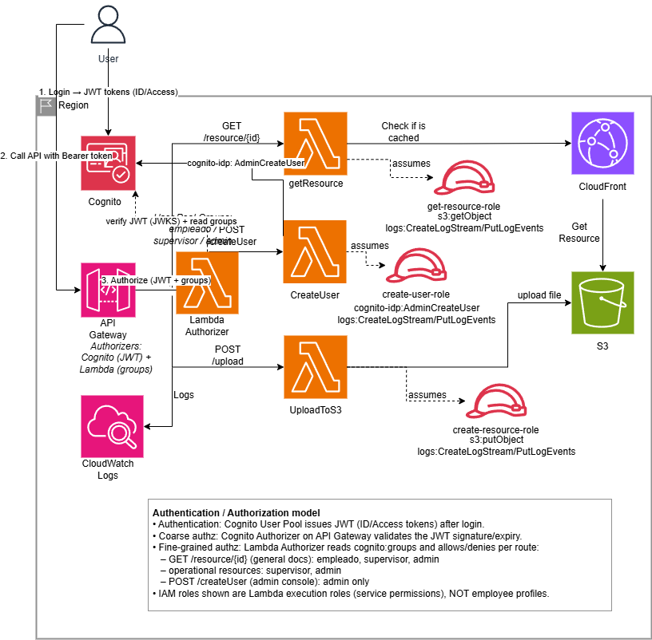

# Login System — Employee Portal Auth (AWS)

Centralized **authentication + per-profile authorization** for an internal employee portal, built
on Amazon Cognito, API Gateway, Lambda, S3, CloudFront, IAM and CloudWatch. Employees fall into
three profiles — `empleado`, `supervisor`, `admin` — and every API route is gated on the caller's
Cognito group.



> **Status:** all 10 phases of `docs/planLoginSystem.md` are complete. The stack was deployed to a
> real AWS account, exercised end to end (login → TOTP MFA → access token → authorized API call)
> and then destroyed, so `terraform/terraform.tfstate` currently holds **no resources** — a fresh
> `terraform apply` recreates it. Tests: **52 passing** offline, **41 live tests** that skip unless
> `LIVE_*` is set, and **6** `terraform test` assertions. A few designed capabilities — federation,
> WAF, Cedar — are deliberately **not** built; see [Future improvements](#future-improvements).

## How it works

1. **Login.** The user authenticates directly against the **Cognito user pool** over SRP and must
   answer a **TOTP MFA challenge** — the pool is `mfa_configuration = "ON"`, so the password step
   alone never yields tokens. A first-time user enrols an authenticator (`MFA_SETUP`); afterwards
   each sign-in answers `SOFTWARE_TOKEN_MFA`. Only then does Cognito issue ID/access/refresh tokens.
2. **Call.** The client calls **API Gateway** directly with `Authorization: Bearer <access token>`.
   Cognito never proxies requests to API Gateway.
3. **Authorize.** A single **Lambda REQUEST authorizer** runs on every method and does both jobs:
   full JWT verification (JWKS/RS256, `exp`, `iss`, `client_id`, `token_use == access`) **and**
   per-route RBAC on `cognito:groups`. It returns an explicit Allow/Deny IAM policy and stamps the
   caller's groups into the request context.
4. **Execute.** The resource Lambda re-checks the group from that context (defense in depth),
   validates its input, and talks to S3 or Cognito using its own least-privilege execution role.
5. **Observe.** Every function logs to **CloudWatch Logs**; a metric filter + alarm watches
   authorizer denials, and CloudTrail records the API calls.

Objects are read back publicly only through **CloudFront** (origin access control); the S3 bucket
itself blocks all public access.

### Route → group matrix (single source of truth)

| Method / route       | Lambda        | Allowed groups                    | Notable responses |
|----------------------|---------------|-----------------------------------|-------------------|
| `GET /resource/{id}` | `getResource` | `empleado`, `supervisor`, `admin` | `400` bad id · `404` missing |
| `POST /upload`       | `uploadToS3`  | `supervisor`, `admin`             | `415` content type · `413` >5 MiB · `400` bad key |
| `POST /createUser`   | `createUser`  | `admin` only                      | `400` bad email/group · `201` created |

A request with no token gets `401` from API Gateway; a valid token in the wrong group gets `403`
with an explicit-deny message. Unknown routes and any authorizer error **fail closed** to Deny.

> **IAM roles ≠ employee profiles.** `get-resource-role`, `create-user-role` and
> `create-resource-role` in the diagram are Lambda **execution** roles (service-to-service
> permissions). The employee permission model lives in Cognito groups + the authorizer.

## Layout

```
src/                Python 3.12 Lambda functions
  authorizer/       handler.py + verify.py (JWT verification, RBAC, policy building)
  get_resource/     GET /resource/{id}
  upload_to_s3/     POST /upload
  create_user/      POST /createUser
  common/           Shared helpers (JSON responses, group re-check, errors)
tests/              pytest suite — unit + moto-backed integration
  live/             smoke tests against a deployed stack (skipped without LIVE_*)
terraform/          IaC: cognito, iam, lambda, apigateway, s3, cloudfront, cloudwatch
  modules/iam/      the four least-privilege execution roles
  tests/            *.tftest.hcl native plan-time tests
scripts/            live_env.ps1 (export stack coordinates), live_tokens.py (seed users + mint tokens)
docs/               research + implementation plan
```

## Lambda code — pytest

Requires Python 3.12+.

```bash
python -m venv .venv
source .venv/Scripts/activate      # Windows (Git Bash);  .venv/bin/activate on macOS/Linux
pip install -r requirements-dev.txt

python -m pytest                                # whole suite
python -m pytest tests/test_authorizer_rbac.py  # a single file
python -m pytest -k "deny_by_default"           # a single test by name
```

Test config (`pythonpath = ["src", "src/authorizer", "scripts"]`, `testpaths = ["tests"]`) lives in
`pyproject.toml`, so handlers import as `from common.http import ...`, `import verify`, etc.
The `tests/live/` suite is marked `live` and skips itself while the `LIVE_*` variables are unset,
so the default run stays green offline.

## Infrastructure — Terraform

Requires Terraform >= 1.9 (for `terraform test`).

**Build the shared Lambda layer first.** `lambda.tf` packages the shared `common` package plus
PyJWT as a layer by zipping `terraform/build/layer` with an `archive_file` data source. That data
source is read **at plan time**, so the directory must exist before `terraform
validate`/`test`/`plan` — otherwise the plan fails with *"could not archive missing directory:
./build/layer"*. It is a generated, git-ignored artifact:

```bash
cd terraform
python -m pip install -r ../src/common/requirements.txt -t build/layer/python   # PyJWT[crypto]
mkdir -p build/layer/python/common && cp ../src/common/*.py build/layer/python/common/
```

Then run the config:

```bash
terraform init -backend=false      # installs providers (incl. archive); no remote state needed
terraform validate                 # static check of the config
terraform fmt -recursive -check    # HCL formatting gate (drop -check to auto-format)
terraform test                     # plan-only assertions in terraform/tests/*.tftest.hcl
```

Copy `terraform/terraform.tfvars.example` to `terraform/terraform.tfvars` to override defaults
(region, project name, portal origin/callback URLs, throttling limits, token validity, log level).

> The wheels installed above are for your **local** platform. A real AWS deploy needs Linux/Python
> 3.12 wheels — reinstall with `--platform manylinux2014_x86_64 --python-version 3.12
> --only-binary=:all:`, or build in a container.

## Deploying and exercising a live stack

With AWS credentials configured:

```bash
cd terraform && terraform apply
```

Then, from the repo root in PowerShell:

```powershell
. .\scripts\live_env.ps1          # exports LIVE_* from `terraform output`
python scripts\live_tokens.py     # seeds one user per profile and mints access tokens
. .\.live-tokens.ps1              # loads LIVE_TOKEN_EMPLEADO / _SUPERVISOR / _ADMIN
python -m pytest tests/live -m live
```

`scripts/live_tokens.py` walks the **real** sign-in flow — `AdminCreateUser` → permanent password
→ `USER_SRP_AUTH` → TOTP enrolment → `SOFTWARE_TOKEN_MFA` — because the deployed app client allows
SRP only and the pool enforces MFA. Nothing is relaxed to make tokens obtainable. Credentials and
TOTP secrets are cached in `.live-users.json` (git-ignored); `--reset` deletes the seeded users,
`--user <email> --group <g> --token-only` mints a token for one ad-hoc user.

`commandInstructions.md` is the manual runbook that walks the same paths with `curl`: fetch a
resource as all three profiles, upload as supervisor (and get denied as `empleado`), create a user
as admin, then log in as that new user and watch a group promotion change what they can do.

**Tokens are valid 60 minutes** — re-run `live_tokens.py` for fresh ones. Tear the stack down with
`terraform destroy` when you are done.

## Security hardening

| Area | What is enforced | Where |
|------|------------------|-------|
| Token handling | Authorize on the **access token**, not the ID token; `token_use`, `client_id`, `iss`, `exp` all checked | `src/authorizer/verify.py` |
| Fail closed | Any verification/RBAC error, unknown route or unknown group → explicit Deny | `src/authorizer/handler.py` |
| Never trust the client | Groups come from the authorizer context only, and are re-checked in each Lambda | `src/common/http.py` |
| Least privilege | Four separate execution roles, scoped ARNs, no wildcards | `terraform/modules/iam/` |
| S3 | Private bucket, block-public-access, SSE, versioning; CloudFront OAC is the only read path | `terraform/s3.tf`, `cloudfront.tf` |
| API Gateway | Single `CUSTOM` authorizer on every method, per-method rate + burst throttling | `terraform/apigateway.tf` |
| Cognito | Password ≥12 with all classes, advanced security `ENFORCED`, **TOTP MFA required on every sign-in** (`mfa_configuration = "ON"`), auth-code grant only (implicit and password flows off), `prevent_user_existence_errors` | `terraform/cognito.tf` |
| Audit | Per-Lambda log groups with retention, deny metric filter + alarm, CloudTrail | `terraform/cloudwatch.tf` |
| Input validation | Resource-id pattern, upload key/content-type/size limits, email + group validation | resource handlers |

## Documentation

- `docs/planLoginSystem.md` — the approved 10-phase, test-first implementation plan.
- `docs/researchLoginSystem.md` — AWS + OWASP Top 10:2025 analysis behind the design (§2 auth
  flow, §2.2 JWT verification, §3 OWASP mapping, §6 the nine prioritized hardening gaps).
- `commandInstructions.md` — live runbook (see above).
- `CLAUDE.md` / `reference/conventions.md` — working agreements, tooling notes and the gotchas
  that are easy to get wrong.
- `loginSystem.drawio` (+ `.png`) — the architecture diagram; its legend is the canonical source
  for the route → group matrix and role names.

Some working documents (`docs/implementationLoginSystem.md`, `docs/hardeningStatusLoginSystem.md`,
`docs/Sessions/`, `docs/Vulnerabilities/`) are kept locally and git-ignored.

## Future improvements

Everything below was **designed but deliberately not built**. It is listed here so the gap between
the diagram/research and the running system is explicit rather than implied.

### Authentication & authorization model

- **External IdP federation.** `supported_identity_providers` is `["COGNITO"]` only. Google /
  Microsoft (or corporate SAML) sign-in is a design goal, not a deployed one.
- **Amazon Verified Permissions (Cedar)** — research gap #9. The authorizer compares group strings
  against a hard-coded matrix in `src/authorizer/verify.py`. Once rules grow attribute-based
  (resource ownership, time of day, request context), that matrix should move to Cedar policies
  behind the same Lambda authorizer.
- **The diagram's greyed-out "future band"** (federation / WAF / deeper auditing) — research gap
  #8. It is documented in `loginSystem.drawio` as a roadmap layer and is doc-only by agreement.
  Note the band as drawn also lists MFA, which the build has since delivered — the diagram is a
  step behind the code there.

### Edge & network protection

- **AWS WAF** in front of API Gateway and CloudFront. API Gateway throttling (rate + burst) is the
  only request-volume control in place; there are no managed rule sets, IP reputation lists or
  bot controls.
- **Custom domain + TLS certificate.** The API is reachable on its generated `execute-api` URL and
  CloudFront on its generated domain.

### Platform & operations

- **Deployment is manual.** No CI pipeline runs `pytest`, `terraform fmt -check`, `validate` or
  `test` on push, and no pipeline applies the stack.
- **No remote Terraform backend.** State is local (`terraform init -backend=false` in every
  documented invocation), which rules out shared or concurrent use. An S3 + DynamoDB backend with
  locking is the obvious next step before more than one person deploys.
- **The Lambda layer is built for the local platform.** A repeatable deploy needs Linux/Python 3.12
  wheels — `--platform manylinux2014_x86_64 --python-version 3.12 --only-binary=:all:`, or a
  container build wired into CI.
- **Authorizer result caching is off** (`authorizer_result_ttl_in_seconds = 0`), so the authorizer
  runs on every request. Enabling a short TTL trades a little revocation latency for cost and
  latency; it needs a deliberate decision, not a default.
- **No front-end portal.** `callback_urls` and `logout_urls` default to `localhost:3000`
  placeholders, and `portal_origin` is declared but not wired to anything — there are no `OPTIONS`
  methods or CORS headers on the API. The system is exercised through `curl` and the live pytest
  suite.
- **Multi-environment promotion.** `var.environment` currently only feeds the `default_tags` in
  `providers.tf`; there are no per-environment tfvars, workspaces or separate accounts for
  dev/staging/prod.
